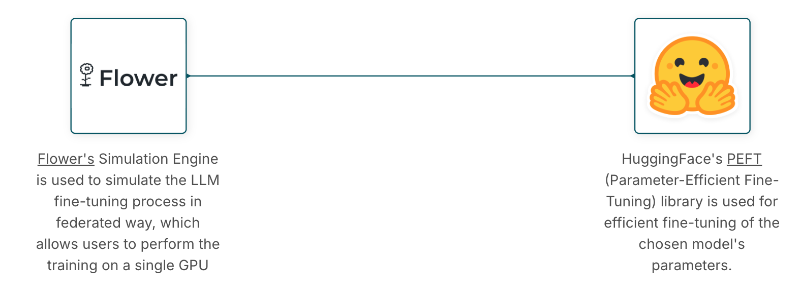

# (COMING SOON) Conduct federated LLM Fine-tuning locally 

This blueprint guides you through getting started with federated fine-tuning of LLMs. It utilizes Flower for federated learningand Hugging Face’s PEFT (Parameter-Efficient Fine-Tuning) for finetuning. This approach enables secure and efficient fine-tuning of LLMs across decentralized data sources

